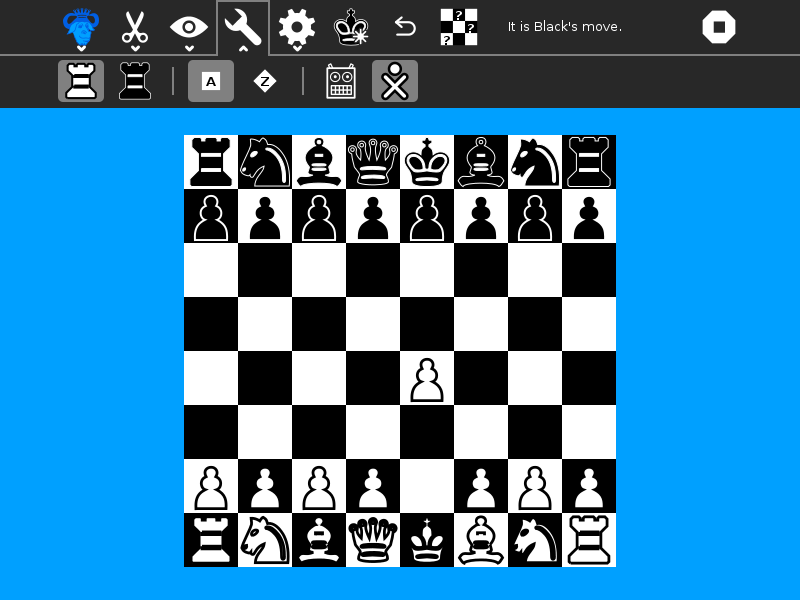

Sugarchess Activity
===============
This is a Sugar front end to the gnuchess program. Some of the artwork comes from the Gcompris chess program. Other artwork was inspired by part from- https://web.archive.org/web/20130310093700/http://lovesexandthermonuclearwar.wordpress.com/2012/04/04/assorted-chess-tools/

More details on gnuchess can be found at:

http://www.gnu.org/software/chess/    and    http://www.gnu.org/software/chess/manual/

How to use?
===============
Sugarchess is not a part of Sugar Desktop but can be added. Refer to the following links-

* [How to Get Sugar on sugarlabs.org](https://sugarlabs.org/), 
* [How to use Sugar](https://help.sugarlabs.org/), and;

Follow chess rules to play. You may play with the robot or with buddies.

Note:
===============
Detailed copyright and license information can be found /COPYING and
/LICENSE.  In the event this file has been separated from the rest of
Sugar GNU Chess, please note that these files have been dual licensed
under the Apache License v2.0 or GPLv3.
